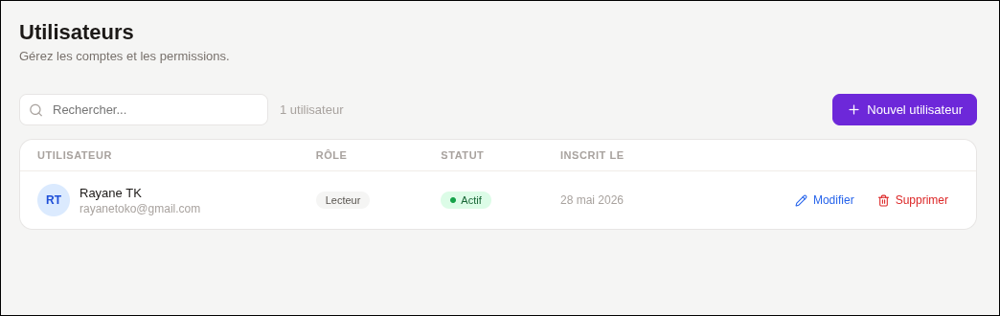
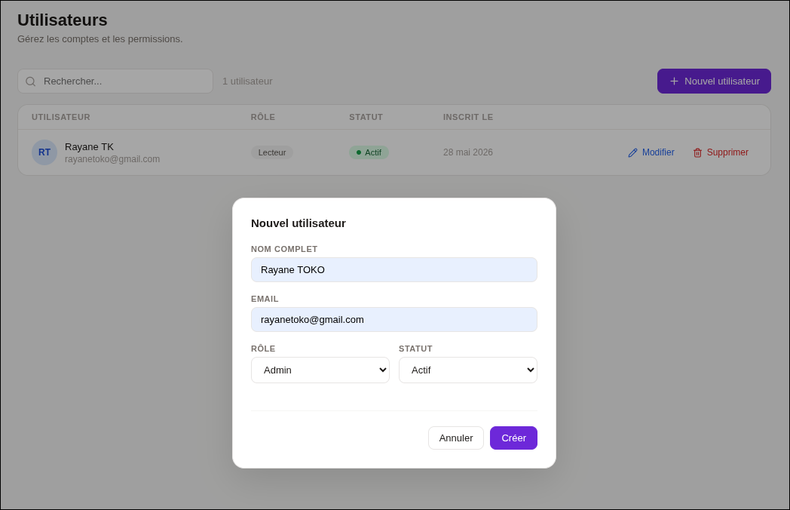
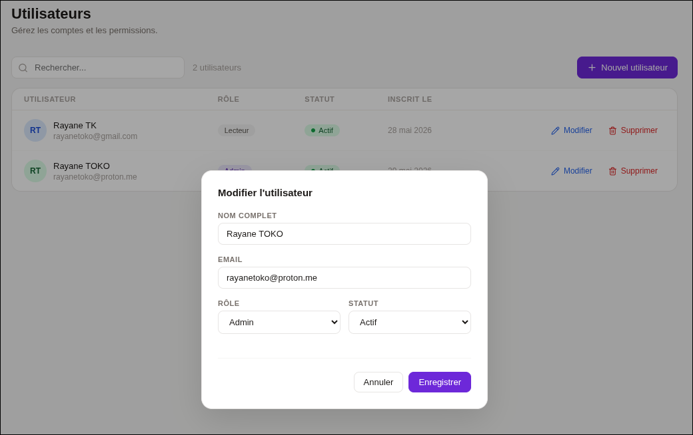
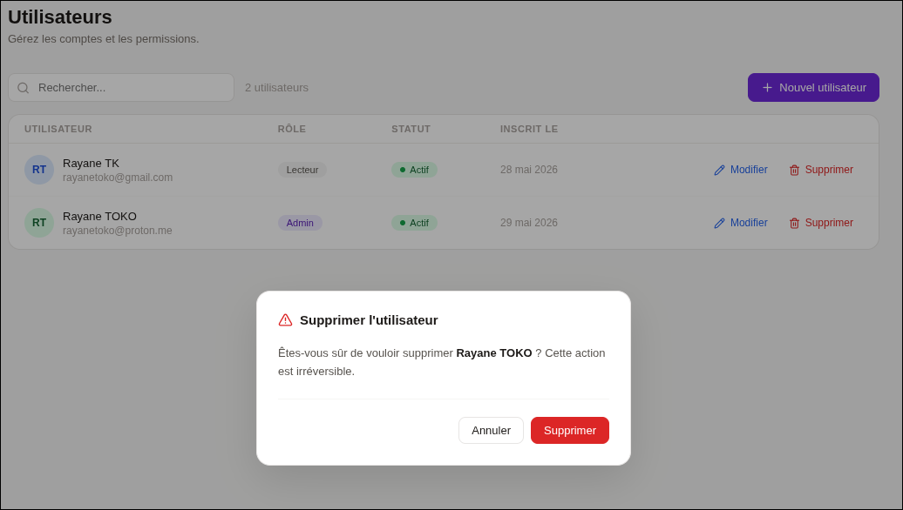

# User Management Application

**Stack** : React · Express · SQLite  
**Version** : 1.0.0  

---

## Table des matières

1. [Présentation](#1-présentation)
2. [Architecture](#2-architecture)
3. [Prérequis](#3-prérequis)
4. [Installation](#4-installation)
5. [Lancement](#5-lancement)
6. [Fonctionnalités](#6-fonctionnalités)
7. [Structure du projet](#7-structure-du-projet)
8. [API Reference](#8-api-reference)

---

## 1. Présentation

Cette application permet de gérer une liste d'utilisateurs au travers d'une interface web. Elle expose les opérations classiques de création, lecture, modification et suppression (CRUD) via une API REST, consommée par un frontend React.

> *L'objectif est de proposer une architecture simple et découplée, où le frontend et le backend communiquent exclusivement via HTTP/JSON.*

---

## 2. Architecture

```
┌─────────────────────┐        HTTP/JSON        ┌──────────────────────┐
│   React (port 5173) │  ─────────────────────► │  Express (port 3001) │
│   UserManagement    │ ◄─────────────────────   │  REST API            │
└─────────────────────┘                          └──────────┬───────────┘
                                                            │
                                                    ┌───────▼──────┐
                                                    │  SQLite DB   │
                                                    │  users.db    │
                                                    └──────────────┘
```

---

## 3. Prérequis

| Outil | Version minimale |
|-------|-----------------|
| Node.js | 18.x |
| npm | 9.x |

---

## 4. Installation

Cloner le dépôt puis installer les dépendances.

```bash
git clone https://github.com/RyanTk03/tp-web.git
cd tp-web

# frontend
cd frontend
npm install

# backend
cd backend
npm install
```

Les packages requis sont les suivants :

```bash
# Backend
npm install express better-sqlite3 cors

# Frontend
npm install react react-dom lucide-react
```

---

## 5. Lancement

Démarrer le backend et le frontend dans deux terminaux séparés.

```bash
# Terminal 1 — API Express
npm run dev
# → http://localhost:3001

# Terminal 2 — Frontend React (Vite)
npm run dev
# → http://localhost:5173
```

---

## 6. Fonctionnalités

### 6.1 Liste des utilisateurs

Au chargement, l'application récupère l'ensemble des utilisateurs enregistrés en base et les affiche dans un tableau. Une recherche en temps réel permet de filtrer par nom ou par adresse email.


*Figure 1 — Vue principale : tableau des utilisateurs avec recherche.*

---

### 6.2 Création d'un utilisateur

Un clic sur **Nouvel utilisateur** ouvre un formulaire modal. Les champs obligatoires (nom, email) sont validés côté backend ; les erreurs sont remontées et affichées directement sous les champs concernés.


*Figure 2 — Modal de création avec validation des champs.*

---

### 6.3 Modification d'un utilisateur

Chaque ligne du tableau expose un bouton **Modifier** qui pré-remplit le formulaire avec les données existantes. La requête émise est un `PUT /api/users/:id`.


*Figure 3 — Modal de modification d'un utilisateur existant.*

---

### 6.4 Suppression d'un utilisateur

Un clic sur **Supprimer** ouvre une modale de confirmation avant d'émettre la requête `DELETE /api/users/:id`. Cette étape prévient toute suppression accidentelle.


*Figure 4 — Modal de confirmation avant suppression.*

---

### 6.5 États de l'interface

L'interface gère trois états distincts : chargement (spinner), erreur réseau (message + bouton *Réessayer*) et liste vide.


*Figure 5 — Exemples d'états : chargement et erreur réseau.*

---

## 8. API Reference

| Méthode | Route | Description | Corps |
|---------|-------|-------------|-------|
| `GET` | `/api/users` | Lister les utilisateurs (`?q=` pour filtrer) | — |
| `GET` | `/api/users/:id` | Récupérer un utilisateur | — |
| `POST` | `/api/users` | Créer un utilisateur | `{ name, email, role, status }` |
| `PUT` | `/api/users/:id` | Mettre à jour un utilisateur | `{ name, email, role, status }` |
| `DELETE` | `/api/users/:id` | Supprimer un utilisateur | — |
| `GET` | `/health` | Vérifier l'état du serveur | — |

**Exemple de réponse (`GET /api/users`) :**

```json
{
  "data": [
    {
      "id": 1,
      "name": "Alice Martin",
      "email": "alice@example.com",
      "role": "admin",
      "status": "active",
      "joined": "2024-01-15"
    }
  ],
  "total": 1
}
```

**Codes de réponse :**

| Code | Signification |
|------|--------------|
| `200` | Succès |
| `201` | Ressource créée |
| `204` | Suppression réussie (pas de corps) |
| `404` | Utilisateur introuvable |
| `500` | Erreur interne du serveur |

---
